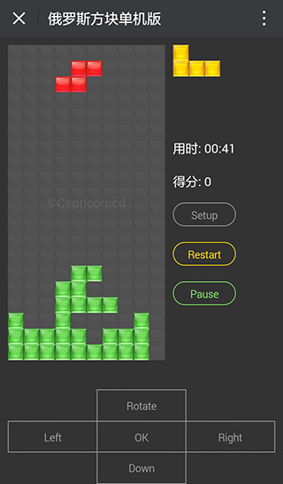

# Tetris Game / 俄罗斯方块

Tetris Game

<p align="left">
   <a href="https://npmcharts.com/compare/zx-tetris?minimal=true"></a>
   <a href="https://www.npmjs.com/package/zx-tetris"></a>
   <a href="https://www.npmjs.com/package/zx-tetris"></a>
 </p>
 
```shell script
npm i zx-tetris
```

## Start

```bash
npm run dev
```

http://localhost:9000

## 游戏截图



### Keyboard 键盘操作

Left: `←`, Right: `→`, Rotate: `↑`, Down: `↓`, OK: `Space`, Pause: `Enter`, Restart: `Shift`

## 扫码体验


https://capricorncd.github.io/tetris/dist

## 初始化方法

```html
<!DOCTYPE html>
<html lang="en">
<head>
  <meta charset="UTF-8">
  <meta name="viewport"
        content="width=device-width, initial-scale=1.0, minimum-scale=1.0, maximum-scale=1.0, user-scalable=no">
  <title>Tetris - 俄罗斯方块单机版 - Capricorncd</title>
  <style>
    body {background-color: #333;}
    .game-box { float: left; margin-right: 10px; padding: 10px; width: 320px; height: 540px; border: 1px solid #999}
  </style>
</head>
<body>

<div class="game-box" id="TetrisA"></div>

<script src="./tetris.min.js"></script>
<script>
  new Tetris({
    // 可选参数，默认为body
    container: '#TetrisA',
    // 错误回调
    error: function (err) {
      console.error(err)
    },
    // 游戏DOM结构创建完成回调
    ready: function (res) {
      console.log(res)
    }
  })
</script>
</body>
</html>

```

## Copyright and license

https://github.com/capricorncd

Code and documentation copyright 2018. Capricorncd. Code released under the MIT License.
